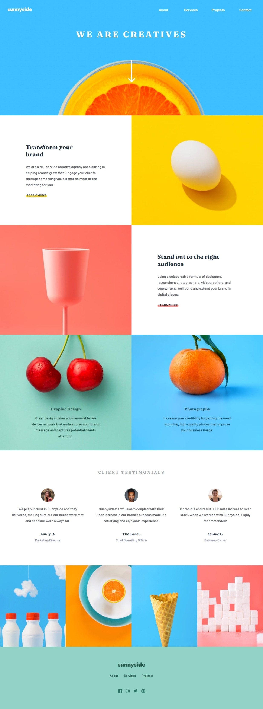
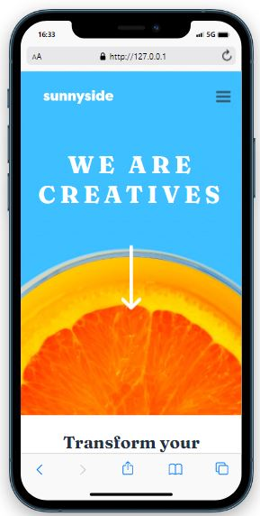
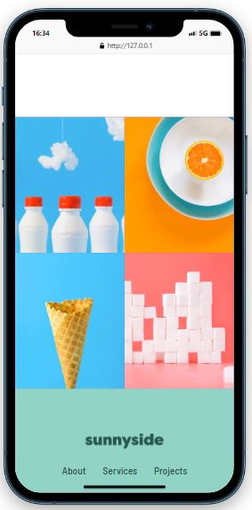

## Sunnyside

- O projeto trata-se de uma landing page, sendo o design e assets inspirados pelo desafio publicado no site [**Frontend Mentor**](https://www.frontendmentor.io/).

## Sumário

- [Tecnologias utilizadas](#tecnologias)
- [Instruções para rodar o projeto](#instrucoes)
- [Organização e estruturação do projeto](#organizacao)
- [Desenvolvimento](#desenvolvimento)
- [Imagens](#imagens)

## Tecnologias Utilizadas <a name="tecnologias"></a>

- [**node-sass**](https://www.npmjs.com/package/node-sass)
- [**autoprefixer**](https://www.npmjs.com/package/autoprefixer)
- [**concat**](https://www.npmjs.com/package/concat)
- [**npm-run-all**](https://react-icons.github.io/https://www.npmjs.com/package/npm-run-all)
- [**postcss-cli**](https://www.npmjs.com/package/postcss-cli)

## Instruções para rodar o projeto <a name="instrucoes"></a>

### Será necessário ter instalado na sua máquina:

```
Git
```

- Clone o repositório com o comando **git clone**:

```
git clone https://github.com/felipehimself/sunnyside.git
```

- Entre no diretório que acabou de ser criado:

```
cd sunnyside
```

- Para o projeto funcionar na sua máquina, será necessário instalar suas dependências, para isso, utilize o comando **npm install**:

```
npm install
```

- Pronto, agora o projeto está pronto para ser rodado localmente, utilizando o comando **npm start**:

```
npm run dev
```

## Organização e estruturação do projeto <a name="organizacao"></a>

O projeto está organizado e estruturado da seguinte forma:

```
│   index.html
│   package-lock.json
│   package.json
│   README.md
│   script.js
│
├───assets
│   └───images
│       ├───desktop
│       │       image-gallery-cone.jpg
│       │       image-gallery-milkbottles.jpg
│       │       image-gallery-orange.jpg
│       │       image-gallery-sugarcubes.jpg
│       │       image-graphic-design.jpg
│       │       image-header.jpg
│       │       image-photography.jpg
│       │       image-stand-out.jpg
│       │       image-transform.jpg
│       │
│       ├───favicon
│       │       favicon-32x32.png
│       │
│       ├───icons
│       │       icon-arrow-down.svg
│       │       icon-facebook.svg
│       │       icon-hamburger.svg
│       │       icon-instagram.svg
│       │       icon-pinterest.svg
│       │       icon-twitter.svg
│       │
│       ├───logo
│       │       logo.svg
│       │
│       └───users
│               image-emily.jpg
│               image-jennie.jpg
│               image-thomas.jpg
│
├───css
│       style.css
│
└───sass
    │   main.scss
    │
    ├───base
    │       _typography.scss
    │
    ├───layout
    │       _article.scss
    │       _footer.scss
    │       _gallery.scss
    │       _hero.scss
    │       _navbar.scss
    │       _section.scss
    │       _testimonials.scss
    │
    └───utilities
            _helpers.scss
            _reset.scss
            _variables.scss
```

## Desenvolvimento <a name="desenvolvimento" ></a>

### Estilização

Para realizar a estilização e controle de compatibilidade, foram utilizados os pacotes:

- [**Node Sass**](https://www.npmjs.com/package/node-sass).
- [**Node Sass**](https://www.npmjs.com/package/node-sass).
- [**postcss-cli**](https://www.npmjs.com/package/postcss-cli).

### Gerais

Para o tratamento da junção dos arquivos CSS gerados pelo SASS foi utilizado:

- [**concat**](https://www.npmjs.com/package/concat).

Para rodar os scripts simultaneamente foi utilizado:

- [**npm-run-all**](https://react-icons.github.io/https://www.npmjs.com/package/npm-run-all).


## Imagens <a name="imagens" ></a>

### Desktop

 


### Mobile

 
 
 
 
 

